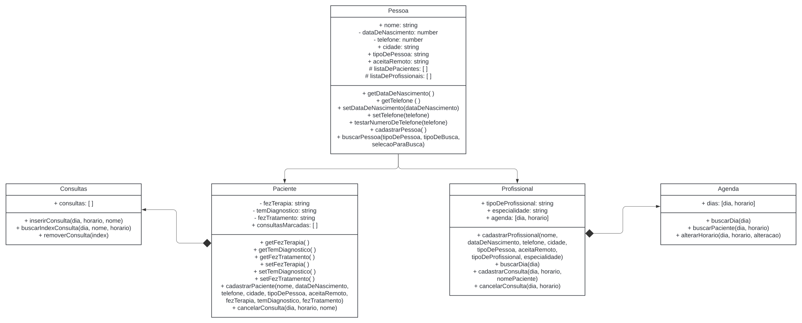

# Projeto final do Imersão JavaScript - Revisitando ideias do Projeto Conexão.

O Projeto Conexão foi meu projeto final do primeiro bootcamp que fiz na {reprograma}. Foi pensado enquanto uma plataforma que pudesse reunir pessoas trans sem acesso a saúde mental e profissionais de saúde mental que aceitassem atender essas pessoas trans. Com o conhecimento que tinha à época criei 4 páginas em React para gerar um site inicial com as Páginas de apresentação, busca de profissionais, inscrição de profissionais e página de contato.

Pensando a partir disso, neste projeto cujo nome inicial é Projeto Conexão 2, crio algumas classes que poderiam inicialmente suprir a necessidade de inscrição tanto de pessoas pacientes quanto de pessoas profissionais, busca de alguma pessoa tanto paciente quanto profissional, e uma agenda inicial que funciona por semana.

## Notas:

### Esse código foi o que achei para solucionar o problema de ordenar os parâmetros de um objeto, mas como não removo mais nenhum parâmetro de objeto, ele não é mais necessário. Fica como curiosidade.

    // const horariosOrdenados = Object.keys(
    //   this.agenda[buscandoDia].horario
    // )
    //   .sort()
    //   .reduce((objeto, chave) => {
    //     objeto[chave] = this.agenda[buscandoDia].horario[chave];
    //     return objeto;
    //   }, {});
    // this.agenda[buscandoDia].horario = horariosOrdenados;